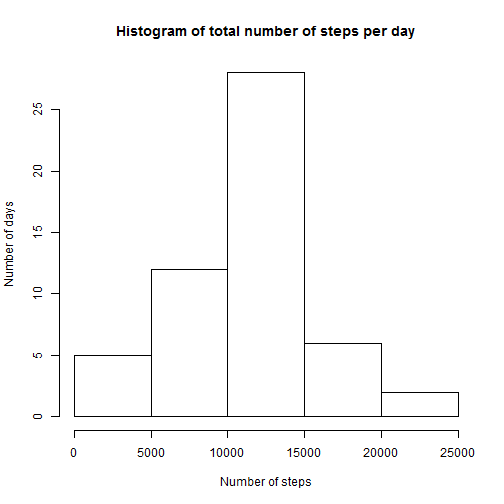
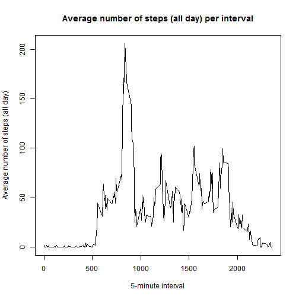
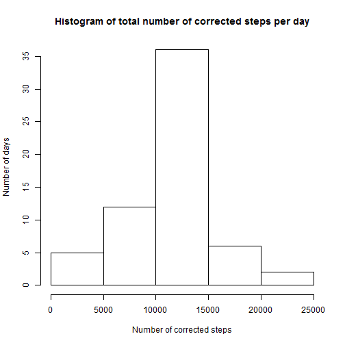
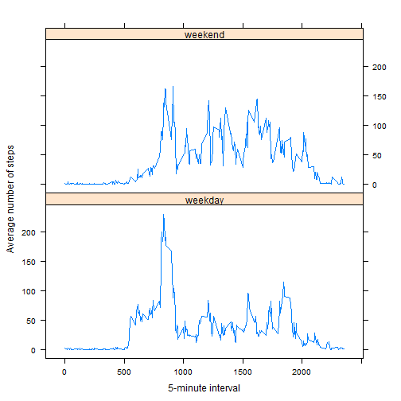

This assignment makes use of data from a personal activity monitoring device. This device collects data at 5 minute intervals through out the day. The data consists of two months of data from an anonymous individual collected during the months of October and November, 2012 and include the number of steps taken in 5 minute intervals each day.

For this RMarkdown-script to work, you need to store the dataset in the same folder as this script. You can download the dataset from [Activity monitoring data](https://d396qusza40orc.cloudfront.net/repdata%2Fdata%2Factivity.zip). Notice, this is a zip file. You need to unzip it to find the dataset `activity.csv`. Downloading and unzipping is out of scope for this assignment. The first you can do with `download.file()` and the letter you can do with `unzip()`. Anyway, I placed the dataset in the same folder as this RMarkdown-script (which you can verify using `which( dir() == 'activity.csv' ) > 0`). 

Before loading the dataset and starting the assessment it is sensible to read what the assessment has to say about the dataset:

The variables included in this dataset are:

* **steps**: Number of steps taking in a 5-minute interval (missing
    values are coded as `NA`)

* **date**: The date on which the measurement was taken in YYYY-MM-DD
    format

* **interval**: Identifier for the 5-minute interval in which
    measurement was taken
    
Source: Peer Assessment's [README.md](https://github.com/RobbertHardin/RepData_PeerAssessment1/blob/master/README.md)

## Loading and preprocessing the data

Show any code that is needed to

1. Load the data (i.e. `read.csv()`);
2. Process/transform the data (if necessary) into a format suitable for your analysis.

I load the dataset into variable *amd*  (short for **a**ctivity **m**onitoring **d**ataset) using `read.csv()`:

```r
amd <- read.csv('activity.csv')
```
Please note `activity.csv` is in the same folder as this RMarkdown file. 

Get a feel for the data by exploring it:

```r
dim(amd)
```

```
## [1] 17568     3
```

```r
names(amd)
```

```
## [1] "steps"    "date"     "interval"
```

```r
str(amd)
```

```
## 'data.frame':	17568 obs. of  3 variables:
##  $ steps   : int  NA NA NA NA NA NA NA NA NA NA ...
##  $ date    : Factor w/ 61 levels "2012-10-01","2012-10-02",..: 1 1 1 1 1 1 1 1 1 1 ...
##  $ interval: int  0 5 10 15 20 25 30 35 40 45 ...
```

```r
head(amd)
```

```
##   steps       date interval
## 1    NA 2012-10-01        0
## 2    NA 2012-10-01        5
## 3    NA 2012-10-01       10
## 4    NA 2012-10-01       15
## 5    NA 2012-10-01       20
## 6    NA 2012-10-01       25
```
The most noticable result is I loaded the `date` as levels. I might have to change that. I'll cross that bridge when I get there :-)

I like `dplyr` so I install this package and add it to my library together with `lattice` which I need later:

```r
install.packages( c( "dplyr", "lattice" )
                 , repos = "http://cran.rstudio.com/"
                 )
```

```
## package 'dplyr' successfully unpacked and MD5 sums checked
## package 'lattice' successfully unpacked and MD5 sums checked
## 
## The downloaded binary packages are in
## 	C:\Users\naam\AppData\Local\Temp\Rtmpc7KTcn\downloaded_packages
```

```r
library( dplyr
        , lattice
        )
```

```
## 
## Attaching package: 'dplyr'
## 
## The following object is masked from 'package:stats':
## 
##     filter
## 
## The following objects are masked from 'package:base':
## 
##     intersect, setdiff, setequal, union
```

## What is mean total number of steps taken per day?

For this part of the assignment, you can ignore the missing values in the dataset.

1. Calculate the total number of steps taken per day;
2. If you do not understand the difference between a histogram and a barplot, research the difference between them. Make a histogram of the total number of steps taken each day;
3. Calculate and report the mean and median of the total number of steps taken per day.

This is the reason why I added `dplyr` to the library. I has a `group_by` function that comes in very handy :-) First I convert `amd` to a `tbl_df` so I can group it by `date` and calculate the total number of steps by day. Notice I don't have to show the total number of steps taken per day directly. I only have to calculate them and put them in a histogram:


```r
# Convert to tbl_df
td_amd <- dplyr::tbl_df( amd )

# Group by date
td_amd_by_date <- dplyr::group_by( td_amd
                                   , date 
                                   )

# Calculate total number of steps per day
total_steps_by_day <- dplyr::summarize( td_amd_by_date
                                        , total_steps = sum( steps ) 
                                        )

# Draw histogram
hist( total_steps_by_day$total_steps
      , main = "Histogram of total number of steps per day"
      , xlab = "Number of steps"
      , ylab = "Number of days"
      )
```

 

```r
# Calculate mean and median (ignoring NA)
mean_tnospd   <- mean( total_steps_by_day$total_steps
                       , na.rm = TRUE 
                       )
median_tnospd <- median( total_steps_by_day$total_steps
                         , na.rm = TRUE 
                         )
```

As a bonus we get the mean and median of the total number of steps taken per day: 10766.1886792453 is the former and 10765 is the latter. 

## What is the average daily activity pattern?

1. Make a time series plot (i.e. `type = "l"`) of the 5-minute interval (x-axis) and the average number of steps taken, averaged across all days (y-axis);
2. Which 5-minute interval, on average across all the days in the dataset, contains the maximum number of steps?

To create the time series plot, I group `td_amd` by `interval` and calculate the average steps taken per interval (ignoring `NA`s). Finally I use plot to, uhm, plot it.


```r
# Group by interval
td_amd_by_interval <- dplyr::group_by( td_amd
                                    , interval 
                                    )

# Calculate average steps by interval
average_steps_by_interval <- dplyr::summarize( td_amd_by_interval
                                               , average_steps = mean( steps
                                                                       , na.rm = TRUE
                                                                       ) 
                                               )

# Plot average steps by interval
with( average_steps_by_interval
      , plot( interval
              , average_steps
              , type = "l" 
              , xlab = "Interval (timeserie)"
              , ylab = "Average steps"
              , main = "Average steps per interval"
              ) 
      )
```

 

Please note you have to read the x-axis as ranging from 00:00 to 23:55, not from 0 to 2,355. This is because `interval` is a time serie.

To find the 5-minute interval containing the maximum number of steps, I first use `which.max()` that returns the *index* of this interval (`104`). Now you migth think, I know I did, that the requested interval is `(104-1)*5`. But in reality it is `835`, meaning 8:35 AM:


```r
max( average_steps_by_interval$average_steps ) 
```

```
## [1] 206.1698
```

```r
which.max( average_steps_by_interval$average_steps ) 
```

```
## [1] 104
```

```r
average_steps_by_interval[ which.max( average_steps_by_interval$average_steps ), ] 
```

```
## Source: local data frame [1 x 2]
## 
##   interval average_steps
## 1      835      206.1698
```

```r
max_interval <- average_steps_by_interval[ which.max( average_steps_by_interval$average_steps ), 1 ]

max_interval
```

```
## Source: local data frame [1 x 1]
## 
##   interval
## 1      835
```
You have to remember `104` is the index in a *grouped* dataset, not in the original dataset. When you look at `average_steps_by_interval` you'll see it has `288` records ranging from `0` to `2355`. Which is correct because there are 24 hours in a day, each hour has 12 chunks of 5-minutes and `12x24 = 288`. You'll also see `average_steps_by_interval` is ordered by interval. Now we can do some fun arithmetic: 104 is 8 times 12 with a remainder of 8. The 8th 5-minute chunk is at 8 minus 1 times 5 is 35 minutes. Giving us 8:35. Which is indeed `max_interval` :-)

## Imputing missing values

Note that there are a number of days/intervals where there are missing values (coded as `NA`). The presence of missing days may introduce bias into some calculations or summaries of the data.

1. Calculate and report the total number of missing values in the dataset (i.e. the total number of rows with `NA`s);
2. Devise a strategy for filling in all of the missing values in the dataset. The strategy does not need to be sophisticated. For example, you could use the mean/median for that day, or the mean for that 5-minute interval, etc.
3. Create a new dataset that is equal to the original dataset but with the missing data filled in;
4. Make a histogram of the total number of steps taken each day and Calculate and report the **mean** and **median** total number of steps taken per day. Do these values differ from the estimates from the first part of the assignment? What is the impact of imputing missing data on the estimates of the total daily number of steps?

`complete.cases` returns a logical vector indicating which observations (rows) are complete, i.e. have no missing values. This is exactly the opposite of what I want. So I use the *Bang*-operator `!` to calculate `nomv` (number of missing values) in `amd`. 


```r
nomv <- sum( !complete.cases( amd ) )
nomv
```

```
## [1] 2304
```

So, the number of missing values in `amd` is 2304.

My strategy for filling the missing values is to calculate the average number of steps in an interval over the full period. This way I hope the differences averages out. It's also convenient for I already have `average_steps_by_interval` :-) So I join `average_steps_by_interval` to `td_amd` on `interval`. This gives me a data frame table with `steps` and `average_steps`. Next I use `dplyr::mutate` to create a new column `corrected_steps` that contains `steps` when present and `average_steps` if not. There is an extra twist, `steps` is an integer but `average_steps` is a numeric, so I round `average_steps` and convert it to an integer with `as.integer( round( average_steps, 0 ) )`.  Finally I remove `steps` and `average_steps` and rename `corrected_steps` to `steps`.


```r
# Join td_amd to average_steps_by_interval on interval
td_amd_extended <- dplyr::inner_join( td_amd
                                      , average_steps_by_interval
                                      , by = "interval" 
                                      )

# Extend td_amd_extended with corrected_steps
td_amd_extended <- dplyr::mutate( td_amd_extended
                                  , corrected_steps = { ifelse( is.na( steps )
                                                                , { as.integer( round( average_steps, 0 ) ) }
                                                                , {steps} 
                                                                ) 
                                                        } 
                                  )

# Remove steps and average_steps
td_amd_extended <- dplyr::select( td_amd_extended
                                  , corrected_steps
                                  , date
                                  , interval 
                                  )

# Rename corrected_steps
td_amd_extended <- dplyr::rename( td_amd_extended
                                  , steps = corrected_steps 
                                  )

# Check td_amd_extended
names( td_amd_extended )
```

```
## [1] "steps"    "date"     "interval"
```

```r
head( td_amd_extended )
```

```
## Source: local data frame [6 x 3]
## 
##   steps       date interval
## 1     2 2012-10-01        0
## 2     0 2012-10-01        5
## 3     0 2012-10-01       10
## 4     0 2012-10-01       15
## 5     0 2012-10-01       20
## 6     2 2012-10-01       25
```

So `td_amd_extended` is the requested new dataset.

To create the histogram of total number of steps taken each day I reuse my code from the second question *What is mean total number of steps taken per day?*


```r
# Group by date
td_amd_extended_by_date <- dplyr::group_by( td_amd_extended
                                            , date 
                                            )

# Calculate total number of corrected steps per day
total_corrected_steps_by_day <- dplyr::summarize( td_amd_extended_by_date
                                                  , total_corrected_steps = sum( steps ) 
                                                  )

# Draw histogram
hist( total_corrected_steps_by_day$total_corrected_steps
      , main = "Histogram of total number of corrected steps per day"
      , xlab = "Number of corrected steps"
      , ylab = "Number of days"
      )
```

 

```r
# Calculate mean and median
mean_tnocspd   <- mean( total_corrected_steps_by_day$total_corrected_steps
                        , na.rm = TRUE 
                        ) # Option na.rm is not necessary anymore, but it doesn't hurt.
median_tnocspd <- median( total_corrected_steps_by_day$total_corrected_steps
                          , na.rm = TRUE 
                          ) # Option na.rm is not necessary anymore, but it doesn't hurt.
```

As a bonus we get the mean and median of the total number of *corrected* steps taken per day: 10765.6393442623 is the former and 10762 is the latter.

To increase readability, I round the means to one decimal. The original mean is *10766.2* and the corrected one is *10765.6*. As you can see there is almost no difference. This sounds logical, because all I did was adding the average to the average. This should make a difference though to the median. The original median is *10765* and the corrected median is *10762*. Indeed there is a difference of *3*.

As I replaced the `NA`s by non-negative numbers (some of them were zero), the total daily number of steps did not decrease. In fact it increased !

## Are there differences in activity patterns between weekdays and weekends?

For this part the `weekdays()` function may be of some help here. Use the dataset with the filled-in missing values for this part.

1. Create a new factor variable in the dataset with two levels - "weekday"" and "weekend"" indicating whether a given date is a weekday or weekend day.

2. Make a panel plot containing a time series plot (i.e. `type = "l"`) of the 5-minute interval (x-axis) and the average number of steps taken, averaged across all weekday days or weekend days (y-axis). See the README file in the GitHub repository to see an example of what this plot should look like using simulated data.

`weekdays()` returns days of the week in the language that is set in locale. To make sure my code also runs in other locales I change it to English. Afterwords I will change it back. 
In English `weekdays()` returns "Saturday" and "Sunday" on weekends. Notice the capital init. Just as before I will use `dplyr::mutate` to add a new factor column called daytype containing either "weekday" or "weekend". Column `date` still is a factor. `weekedays()` cannot handle factors. Hence I convert these factors to levels and convert them to class "Date": `as.Date( levels( date )[date] )`. 


```r
# Back up my LC_TIME
myLC_TIME <- Sys.getlocale( category = "LC_TIME" )

# Switch to English
Sys.setlocale(category = "LC_TIME"
              , locale = "English"
              )
```

```
## [1] "English_United States.1252"
```

```r
# Add factor column daytype
td_amd_extended <- 
    dplyr::mutate( td_amd_extended
                   , daytype = factor( ifelse( weekdays( as.Date( levels( date )[date] ) ) %in% c( "Saturday", "Sunday" )
                                               , "weekend"
                                               , "weekday" 
                                               ) 
                                       )
                   )
```

After adjusting my data set it is time to make the plots. Just as in one of the previous exercises, I start by making a grouped data frame table. This time I group by `interval` (necessary for the *x*-axis) and `daytype` (necessary to split the panels). For the *y*-axis I need to calculate the average steps taken per interval. And finally, I create the panel plot using `xyplot()` from the *lattice*-package which I installed at the begining.


```r
# Group by interval
td_amd_extended_by_interval <- dplyr::group_by( td_amd_extended
                                                , interval
                                                , daytype
                                                )

# Calculate average steps by interval
td_amd_extended_average_steps_by_interval <- dplyr::summarize( td_amd_extended_by_interval
                                                               , average_steps = mean( steps
                                                                                       , na.rm = TRUE 
                                                                                       ) 
                                                               )

# Plot average steps by interval split by daytype
lattice::xyplot(average_steps ~ interval | daytype
                , data = td_amd_extended_average_steps_by_interval
                , type = "l"
                , layout = c(1, 2)
                )
```

 

```r
# Restore my LC_TIME
Sys.setlocale(category = "LC_TIME", locale = myLC_TIME)
```

```
## [1] "Dutch_Netherlands.1252"
```
